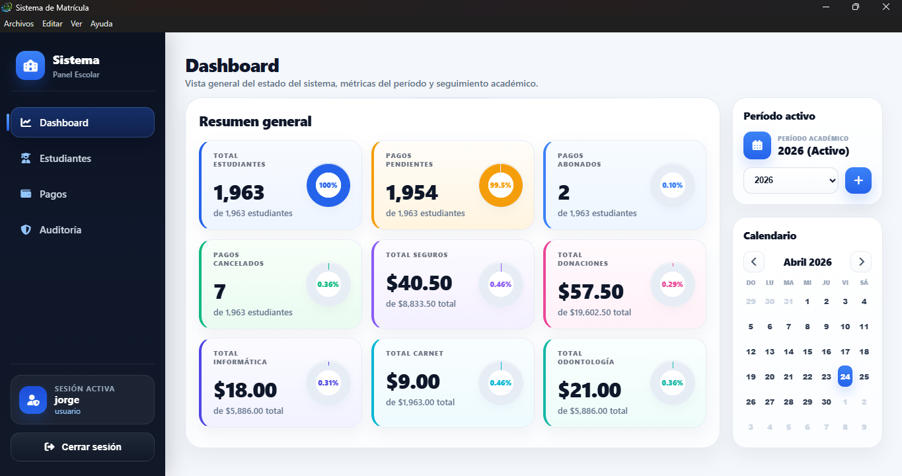
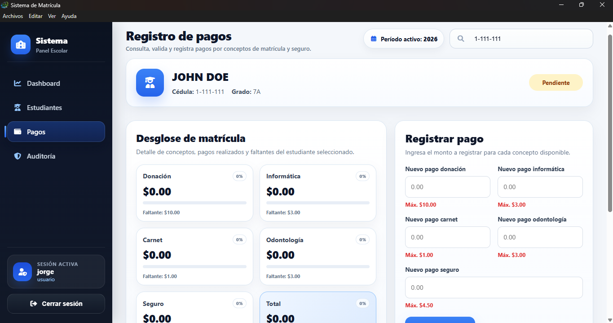
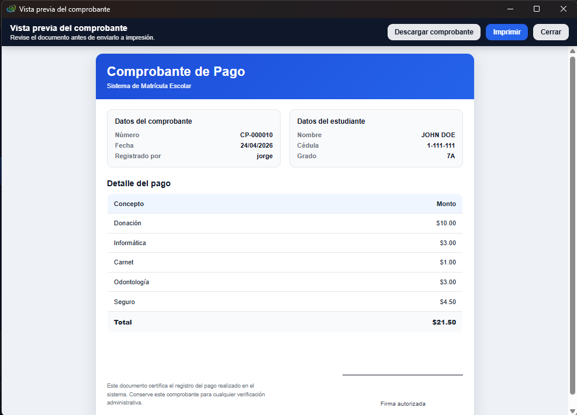

<p align="center">
  
</p>

# 🎓 Sistema de Matrícula Escolar

Sistema completo para la gestión de matrículas escolares, desarrollado como una aplicación de escritorio con Electron y SQLite para entornos educativos reales.

---

## 📌 Descripción

El Sistema de Matrícula Escolar permite registrar estudiantes, gestionar pagos por conceptos, generar comprobantes y llevar un historial completo de transacciones de manera organizada y segura.

Está diseñado especialmente para **asociaciones escolares o administrativas** encargadas del proceso de matrícula.

---

## 🏆 Proyecto real

Este sistema fue desarrollado e implementado como una solución funcional en una asociación escolar, siendo utilizado en un entorno real para la gestión de matrículas y pagos.

---

## ⭐ Características destacadas

- Sistema completo listo para producción  
- Interfaz moderna y amigable  
- Arquitectura modular escalable  
- Control de pagos con validaciones automáticas  
- Generación de comprobantes profesionales  

---

## 📸 Capturas

### Dashboard


### Gestión de pagos


### Comprobante de pago


---

## 🚀 Funcionalidades principales

- 👨‍🎓 Registro y gestión de estudiantes  
- 🔁 Rematrícula de estudiantes existentes  
- 💰 Gestión de pagos por conceptos:
  - Donación
  - Informática
  - Carnet
  - Odontología
  - Seguro  
- 🧾 Generación de comprobantes de pago imprimibles  
- 📊 Historial de pagos por estudiante  
- 👨‍👩‍👧‍👦 Gestión de grupos familiares (descuento por hermanos)  
- 🏫 Manejo de períodos académicos  
- 🔐 Sistema de autenticación de usuarios  
- 📁 Importación de datos desde Excel  
- 💾 Copias de seguridad (backups)  

---

## 🛠️ Tecnologías utilizadas

- Electron.js  
- Node.js  
- SQLite  
- HTML, CSS, JavaScript  

---

## 📦 Instalación (modo desarrollo)

```bash
npm install
npm start
```
---

### ▶️ Ejecución

Al iniciar la aplicación:

- Se abrirá la ventana principal del sistema  
- Podrás iniciar sesión  
- Acceder a módulos como estudiantes, pagos y reportes  

---

## 💻 Ejecutable

El sistema cuenta con un instalador `.exe` para Windows, implementado en un entorno real.

Por motivos de uso comercial, el ejecutable no se distribuye públicamente.

---

## 🎯 Público objetivo

- Asociaciones escolares  
- Centros educativos  
- Instituciones que gestionan matrículas 

---

## 📌 Autor

Desarrollado por **Jorge Ladrón de Guevara**

---

## 🧾 Versión

v1.0.0

---

## 📄 Licencia

Proyecto desarrollado como solución real para gestión de matrículas en entornos educativos.  
Uso y distribución reservados.